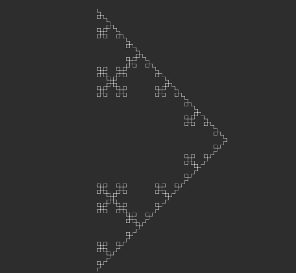
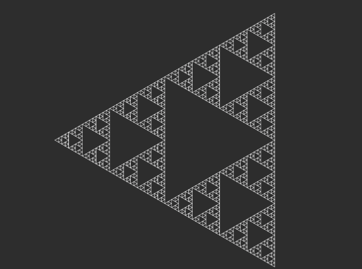
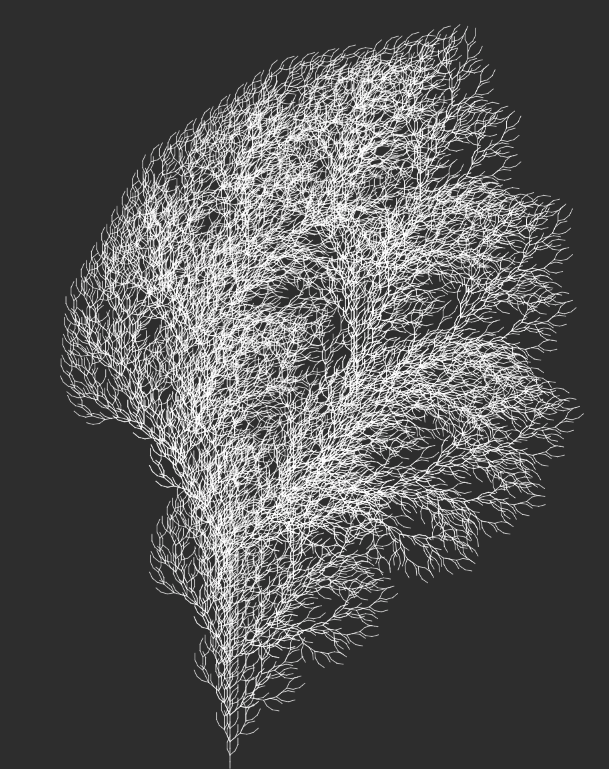

# L-system

"An L-system or Lindenmayer system is a parallel rewriting system and a type of formal grammar" [see Wikipedia](https://en.wikipedia.org/wiki/L-system"). This code was initially inspired by the work of Daniel Shiffman in this domain.

The js file containes grammar definition for 3 systems:

# Koch curve
   

# Sierpinski triangle
   

# Tree (Daniel Shiffman)
   

